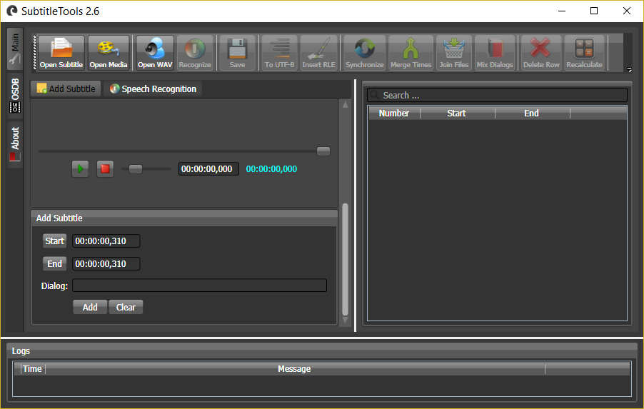

[SubtitleTools](https://github.com/VahidN/SubtitleTools/releases) is a small utility that helps modifying existing subtitles or downloading new ones based on the digital signatures of your movie files from opensubtitles.org site.

Features
---
  - Integrated with speech recognition engine of windows 7+ to produce subtitles automatically.

  - Integrated with Bing's translator.

  - Converting encoding of the opened .srt file to UTF-8.

  - Synchronizing a subtitle and shifting its timespans.

  - Adjusting timespans of the opened .srt file based on the other fully synchronized .srt file.

  - Merging two .srt files.

  - Editing or deleting rows of the opened .srt file.

  - Downloading or uploading .srt files by using XML-RPC API of the opensubtitles.org.

Supported Operating Systems
---
Microsoft Windows 7 SP1 or later

Download
---
   - [Releases](https://github.com/VahidN/SubtitleTools/releases)

Prerequisites
---
   - [Microsoft .NET Framework 4.8](https://dotnet.microsoft.com/en-us/download/dotnet-framework/net48)

